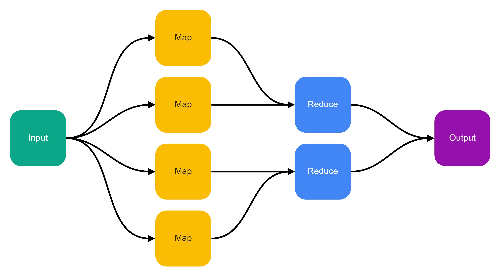

<h2 style="text-align:center;">Università degli Studi di Milano</h2>

<h3 style="text-align:center;">Facoltà di Scienze e Tecnologie</h3>

<h3  style="text-align:center;">Corso di Laurea in Sicurezza dei sistemi e delle reti informatiche</h3>

<h1  style="text-align:center;">Apache Hive and Apache Druid performance testing for MIND Foods HUB Data Lake</h1>


**Relatore**: Prof. Paolo Ceravolo, <paolo.ceravolo@unimi.it>

**Correlatore **: Filippo Berto, <filippo.berto@unimi.it>

**Tesi di**: Gabriele D'Arrigo, <gabriele.darrigo@studenti.unimi.it>

**Matricola**: 909953

**Anno Accademico**: 2021-2022

<div style="page-break-after: always; visibility: hidden;"></div>

## Table of contents

0. Abstract
1. Introduction
    1.1 Big Data and Data Lake systems
    1.2 Hadoop
    1.3 Apache Hive
    1.4 Apache Druid
    1.5 Apache JMeter
2. Performance Testing and methodology
    2.1 Provision of each solution
    2.2 Data generation
    2.3 Data ingestion
    2.4 Queries
    2.5 Performance testing using Apache JMeter
3. Test results
4. Conclusions
4. References

<div style="page-break-after: always; visibility: hidden;"></div>

## Abstract

In Big Data, testing, comparing and choosing between different databases suited to work with large amounts of data is not an easy operation, since multiple characteristics should be taken into account: performances, scalability, operation and maintenance costs and, obviously, the type of analytical processing that needs to be supported.
In this paper, I describe how I provisioned, ingested, and performance tested two Big Data solutions, Apache Hive and Apache Druid, in the context of an actual use case: MIND Foods HUB. 
This international, interdisciplinary project employs a Data Lake infrastructure to store and analyze plant cultivation data. 
The results show how Apache Druid is a strong, better alternative to Apache Hive, outperforming it in every scenario.

**Keywords**: Big Data, Data Lake, Performance Testing, Apache Hive, Apache Druid

## 1. Introduction

MIND Foods HUB [1] is an international, interdisciplinary project led by various public and private subjects (including Università Degli Studi di Milano, TIM and others) that operates in the context of the Milan Innovation District [2].
Its goal is to "implement a computational infrastructure to model, engineer and distribute data about plants phenotyping" [3].
The project, split into different stages, plans to:

1. Identify crops with optimal nutritional profiles
1.  Creation of a Germplasm bank of the selected species
2. Farm the selected species in protected environments (greenhouses and vertical farms) 
3. Apply high-throughput phenotyping applications on the plant's cultivations
4. Create a computing infrastructure by employing smart devices and sensors, 5G communication networks, and Big Data platforms
5. Analyze the collected data to study the nutritional properties and bioactive components of the selected species and develop prediction models of nutritional and functional value

<figure>
    
    <figcaption>Figure 1: MIND Foods Hub computing infrastructure</figcaption>
</figure>

The computing infrastructure, made by different modules, consists in:

- A rover, equipped with different phenotyping sensors that take on-fields measurements on plants cultivation
- Various on-field sensors that register weather or environmental data, like air temperature and humidity, soil temperature, leaf wetness, etc.
- A 5G communicating network to support the sensor's data transmission
- Different software collection agents collect data from the rover and the on-field sensors and upload them to the Data Lake
- A Data Lake platform to store sensor's data and supports data analysis
- An hybrid GraphQL/REST API developed in Rust to access and consume data stored in the Data Lake platform
- FoodsAPP, a client application: a user could scan QRcode that identifies a specific cultivation to visualize its raw and processed sensors data

The implementation of the computing infrastructure involved various technological partners; TIM, the first Italian provider of fixed, mobile and cloud infrastructures, developed the 5G network, the on-field sensors, and the client application.
Multiple departments of Università Degli Studi di Milano have been involved in the MIND Foods HUB project. 
The Dipartimento di Scienza Agrarie e Ambientale (**DISAA**) designed and implemented the rover, its sensors, and the algorithms that analyze the nutritional properties of the chosen species.
The SEcure Service-oriented Architectures Research Lab (**SESAR** Lab) planned and implemented all software modules of the computing infrastructure: the collection agents, the GraphQL/REST API, the data model to structure sensor's data and the Data Lake platform.
The MIND Foods HUB Data Lake platform is based, among other components, on Hadoop [5], a framework for parallel and distributed processing of large data sets and Apache Hive [6]. This software allows reading, writing, and managing large data-sets in distributed storage using SQL. 

When I joined the project, the SESAR Lab team was already investigating faster alternatives to Hive due to its poor reading performance on even simple aggregations queries. That's where I started to study and test Apache Druid [7], a real-time database, as a viable, more performant solution than Hive to improve MIND Foods HUB Data Lake efficiency.

Section 1.1 shortly describe Big Data and Data Lake systems. Then, sections 1.2 and 1.3 introduce the Hadoop architecture and the design of Apache Hive. Section 1.4 presents Apache Druid, explaining its key concepts and use cases.
Section 2 demonstrates the testing methodologies employed to test Apache Hive and Apache Druid with JMeter [8]; Section 3 illustrates the testing results, while section 4 concludes this paper.

### 1.1 Big Data and Data Lake systems

We live in the age of data: mobile phones, smart devices, sensors, social networks, etc., all concur in a scenario where all information is digital and needs to be processed, stored and analyzed. 
According to statistics, a person produces 1.7 MB of data per second [9]; globally, 44 zettabytes of data are generated daily. Based on research [10] led by Seagate and IDC, the amount of global data will reach 175 zettabytes by the end of 2025. 
This exponential explosion of data generation directly impacts organizations facing the challenge of managing a massive amount of data, coming from multiple sources at an ever-increasing rate; days are gone when a single database serves as the primary source of truth of an entire business. That's where new Big Data technologies can make the difference in how organizations make business decisions based on their data.

#### Big Data

Big Data is a universal term [11] that refers to data that is "too big, too fast, or too hard" [12] to be processed or analyzed by traditional methods or technologies. To be so considered, Big Data is characterized by the "three Vs", a concept formulated by Doug Laney from Meta (now Gartner) in 2001 [13]: *Volume*, *Velocity*, *Variety*.

- *Volume* is a property that determines the size of the data, usually expressed in petabytes.
- *Velocity* refers to the speed at which data is generated and processed. Generally, data processing happens in batch, where a large volume of data within a specific time is processed, on in a stream mode, where data is processed in real-time as it is produced.
- *Variety* is a property that refers to different types of data produced by multiple sources; usually, types fall in one of these three categories: structured data (relational data with an enforced data model, often stored in tables), semi-structured data (like XML or JSON), and unstructured data (data not arranged according to a data model, for example, text, images, video, etc.)

<figure>
    
    <figcaption>Figure 2: Big Data three Vs</subfigcaption
</figure>

Over time the three Vs concepts of Big Data have been complemented by two additional properties: *Veracity* [14] and *Value*.

- *Veracity* is a property that refers to the degree of reliability associated with certain data types. For example, some data is inherently uncertain or unpredictable (sentiments in social media, weather, economics) regardless of the data cleansing method applied; yet, these data types still contain valuable information.

- *Value* is a property that refers to the social or economic value generated from the data. Value is the desired outcome of Big Data processing since data has no inherent value without any process that analyzes the data to understand how to employ them.

#### Data Lake systems

These Big Data concepts heavily changed the shape of traditional data management systems, like Data Warehouses, that now need to support parallel data processing, complex analytical workflow, resilient and flexible storage capable of efficiently persisting data from several sources. Also, with the rise of new Big Data technologies, further models to store and analyze data have been developed to take advantage of the emerging new Big Data technologies; one for all: Data Lake systems.

Historically, organizations that need to reconcile data from different Online Transaction Processing (**OLTP**) data sources employed a Data Warehouse system.
A Data Warehouse is a system used for reporting and data analysis that store historical, time-variant collection of data in a single repository [15], typically operated by business end-users to support management's decision.
Since data ingested into Data Warehouses usually comes from relational OLTP systems, the most used data processing paradigm in data warehousing is Extract, Transform, Load (**ETL )**.

<figure>
    
    <figcaption>Figure 3: ETL</subfigcaption
</figure>

The standard ETL approach expects to extract data from different sources, apply some data transformation to adhere to the schema adopted to structure the data, and finally load it into the Data Warehouse. This process, also known as schema-on-write, allows efficient and fast reads operations at the cost of designing and maintaining a schema that describes the shape of the data.

Data Lake is a term coined in 2011 by James Dixon [16], founder and former CTO of Pentaho: a Data Lake is a repository that stores large quantities and varieties of data in their raw format, independently from their source or structure. 
Unlike traditional Data Warehouses, which pursues an ETL approach, Data Lake systems use an Extract, Load, Transform (**ELT**) data processing paradigm. 

<figure>
    
    <figcaption>Figure 4: ELT</subfigcaption
</figure>
ELT doesn't apply any prior data transformation since a Data Lake can store structured, semi-structured or unstructured data. Instead, data is ingested as soon as it becomes available in its raw format, allowing for fast write operations and the advantage of preserving the original data structure. 
Then, only during a particular analysis the required data is extracted and transformed in a structure suited to be interpreted, applying what is described as a schema-on-read process.

<div style="page-break-after: always; visibility: hidden;"></div>

### 1.2 Hadoop

Hadoop is an open-source framework that enables reliable, scalable, distributed computing.
Started in 2002 as an open-source project by Doug Cutting and Mike Cafarella, that was developing a search engine capable to index 1 billion pages, the first version of Hadoop implemented two powerful computing concepts introduced by Google in 2003 and 2004: Google File System (**GFS**) [17], a scalable distributed file system for large distributed data-intensive applications, and MapReduce [18], a programming model for processing and generating large data sets.

So, at its core, Hadoop is composed of two modules: storage and processing. The storage component is the Hadoop Distributed File System (**HDFS**), while the processing component is **MapReduce**.

#### HDFS

HDFS is a highly fault-tolerant, scalable, and distributed file system designed to run on commodity hardware; HDFS provides high throughput access to application data and is suitable for applications that need to compute large data sets.
The goals of HDFS are:

1. Processing of extremely large files, from multiple gigabytes to petabytes. HDFS supports small files but is not optimized for them
2. Enable streaming of data to applications that run on HDFS, allowing high throughput of data access rather than low latency of data access
3. Capability to execute the file system on low-cost hardware; an HDFS cluster can run on hundreds or thousands of server machines, each storing part of the file system's data, making hardware failure the norm rather than an exception
4. Move the computation near the data to avoid the network transfer of large data sets, which is a notoriously slow and costly operation

HDFS is based on a master/slave architecture.
The master server is called **NameNode**, and it manages the file system namespace and regulates client access to files. In HDFS, a file is split into one or more blocks of equal size (default is 128 megabytes); these blocks are stored and replicated in a set of DataNodes.
NameNode responsibility is to handle the mapping of blocks between DataNodes; also, NameNode manages file system namespace operations, like opening, closing, and renaming files and directories, instructing DataNodes on their execution.

**DataNodes** manage the data and the storage attached to the nodes on which they run; they are responsible for serving read and write requests from the file system's clients. Also, DataNodes, when instructed from a NameNode, perform block creation, deletion, and replication.
A typical HDFS cluster can have thousands of DataNodes and tens of thousands of HDFS clients per cluster since each DataNode may execute multiple application tasks simultaneously.

<figure>
    
    <figcaption>Figure 5: HDFS Architecture and data flow</figcaption>
</figure>

Figure 5 shows the HDFS architecture and the flow of I/O operations.

1. An HDFS client wishing to read a file contact the NameNode to determine where the actual data is stored
2. The NameNode returns: the relevant block ids and the location where the blocks are held (i.e., on which DataNodes)
3. The client then contacts the DataNode to retrieve the data

As we can see, to guarantee high data throughput, data never flows through the NameNode but is directly served from the DataNodes.

#### MapReduce

MapReduce is a programming model for processing and generating large data sets. Developed by Google and implemented by Hadoop, its goal is to enable the parallelization of heavy computation tasks, data distribution and failure handling of large amounts of data across hundred or thousand of machines.

The MapReduce model is based on two simple functional programming primitives: **Map** and **Reduce**.

```
map(k1, v1) -> list(k2, v2)
reduce(k2, list(v2)) -> list(v2)
```

The Map function is written by the user and takes a key/value pair as input to generate a set of intermediate key/value pairs. All intermediate values with the same intermediate key are grouped together and passed to the Reduce function.

The Reduce function accepts an intermediate key and a set of values for that key. Then, it merges these values to form a smaller set of values; typically, zero or one output value is produced per Reduce invocation. 
The intermediate values are supplied to the user's reduce function via an iterator that allows handling lists of too large values to fit in memory.

<figure>
    
    <figcaption>Figure 6: MapReduce flow</figcaption>
</figure>
The power of the MapReduce model is that it enables the parallel execution of computation since the Map invocations are distributed across multiple machines of a cluster. 
Figure 6 shows the typical execution flow of a MapReduce application. First, the input data is split into a set of *M* splits; each input splits is processed in parallel by different Map functions, running on different machines. Next, the Map functions' intermediate key/value pairs are passed to the *R* available Reduce functions. The number *R* of  Reducer is obtained by applying a partitioning function on the intermediate key (for example:  `hash(key) mod R`).
The user specifies the number of partitions (R) and the partitioning function; the use of the partitioning function guarantee that the output of the various Map invocations is evenly distributed across the Reducers.

Hadoop implements MapReduce as a framework to process data stored on HDFS.
A MapReduce job is typically implemented in Java; it splits the input data-set into independent chunks processed in parallel by the Map tasks. Next, the framework sorts the outputs of the Maps, which are then input to the Reduce tasks. Usually, both the job's input and output are stored on HDFS. 
The computing and storage nodes are the same, so the MapReduce framework and HDFS run on the same set of nodes; this allows the framework to take advantage of data locality, moving the computation where the data already resides. As a result, data locality helps minimize network congestion because it avoids the transfer of large data sets across the cluster and improves the overall computation throughput.

#### YARN

MapReduce jobs are scheduled by Hadoop's "Yet Another Resource Negotiator" (**YARN**) [19]. This Hadoop layer decouples the programming model from the resource management infrastructure and delegates many scheduling functions to per-application components.
YARN, at its core, is composed of two processes: the **ResourceManager** and the **NodeManager**. 
The ResourceManager is a process that runs on a dedicated node and is responsible for arbitrating cluster's resources among various contending jobs and scheduling job execution depending on resources availability.
YARN resources are called *containers*, a logical set of resources (for example, 2 GB of RAM, 1 CPU) bound to a specific node of the cluster and reserved for executing a MapReduce job.
A  ResourceManager accepts jobs submissions from the clients and asks the NodeManager to allocate the required resources for their execution.  NodeManager processes, one per each Hadoop node, are responsible for container lifecycle: they launch the container, monitor its execution and its resources usage (in terms of CPU, memory, disk, network), and reports the information to the ResourceManager.
The ResourceManager, collecting information from all NodeManagers, can assemble the global status of the cluster and schedule job execution.

It's worth mentioning another component of the YARN architecture: the **TimelineServer** (previously known as the Application History Server), a process that runs on a dedicated node of the cluster.
The TimelineServer collects the historical states for each completed MapReduce job and provides various YARN related metrics  accessible via REST APIs, including:

- The number of Map and Reduce tasks employed for a specific job
- The elapsed time for the job execution
- The final status of the job (succeeded, failed, etc.)
- The allocated memory and virtual cores per container

<div style="page-break-after: always; visibility: hidden;"></div>

### 1.3 Apache Hive

Apache Hive is an open-source Data Warehouse system designed for querying and analyzing large data-sets stored in Hadoop. Hive provides standard SQL functionality with HiveQL, a declarative language that enables users to do ad-hoc querying, aggregation and data analysis.
Apache Hive offers many advantages over working directly on Hadoop: 

- SQL is familiar to many developers and analysts; instead of writing complex MapReduce jobs in Java, a user can submit SQL queries to Hive to compute data stored on HDFS. 
- A mechanism to impose structure, using relational database abstractions, on a variety of data formats
- Since HDFS can hold structured, semi-structured and unstructured data, Hive can read and store table data in various formats, including comma and tab-separated values (CSV/TSV), JSON, Apache Parquet, Apache ORC, and others.

Apache Hive is not designed for OLTP workloads or to support real-time analytics due to its batch-oriented nature. It is best suited for traditional data warehousing tasks: data analysis and distributed processing of massive volumes of data.
Apache Hive is engineered to be scalable, as more machines can be dynamically added to the Hadoop cluster as needed, fault-tolerant, and loosely coupled with its input formats.

#### Design

<figure>
    
    <figcaption>Figure 7: Apache Hive architecture</figcaption>
</figure>


Figure 7 shows the architecture of Apache Hive and its main components:

- **Hive Client**: any kind of client that wants to interact with Hive by running HiveQL queries. Clients usually use Apache Thrift, JDBC or ODBC drivers to connect and communicate with Hive.
- **Driver**: the component that receives those queries and handles the communication with the Compiler, the Optimizer and the Execution engine. It internally uses **HiveServer2**, a process that enables multi-client concurrency and client authentication. HiveServer2 uses a thread pool, allocating a worker thread for each TCP connection instantiated by a client.
- **Compiler**: the component that parses the queries, apply semantic analysis on each query block and expression and, by retrieving table and partitions metadata from the Metastore, eventually generates a query execution plan in the form of a Directed Acyclic Graph (**DAG**).
- **Optimizer**: the component that applies further transformations on the execution plan to optimize query execution.
- **Metastore**: the component that stores all schema's tables, partitions and buckets metadata, including the list of columns, columns type, data location on HDFS, serialization and deserialization strategies required to read and write data from and to tables. Metadata is usually stored on an external relational database, like MySQL or PostgreSQL and not directly on HDFS. 
- **Execution engine**: the component which instructs Hadoop to perform the execution plan.
- **SerDe**: "Serializer and Deserializer" (**SerDe**) is the primary interface used by Hive to perform I/O operations on HDFS. One of the core principles of Hive is that it doesn't own HDFS file format; a user could store data in HDFS in various file formats, and Hive uses SerDe to read and write data back and forth to HDFS supporting that specific file format.

#### Query execution

When the Driver receives a query from a client, it creates a session handle for that client and forwards the query to the Compiler:

1. The Compiler retrieves the necessary metadata from the Metastore; metadata is used to type-check the query expressions and eventually prune partitions data based on query predicates.
2. The Compiler produces a query execution plan in the form of a DAG, where each vertex is a MapReduce job to be executed
2. The Optimizer applies column pruning and other optimizations to the query execution plan
2. The Execution engine submits each MapReduce job of the query execution plan to Hadoop for parallel processing
2. In each task, the SerDe deserializer associated with the table is used to read the rows from HDFS files and to return data to the client

#### Data Model and Storage

In order of granularity, data in Apache Hive is organized into:

- **Databases**: namespaces that group tables, views, partitions, columns etc.
- **Tables**: similarly to relational databases tables, they are homogenous units of data within the same schema. All data of a table is stored in `/user/hive/warehouse/databasename.db/tablename/` directory of HDFS; 
  Apache Hive also supports **external** tables, or instead tables created on preexisting files or directories in HDFS.
- **Partitions**: each table can have one or more partitions keys that determine how the data is stored on HDFS; all data with the same partition key are held together into the same partition. For example, in a table T, with a `date` partition, all data for a particular date are stored in the `T/data=<date>` directory on HDFS. Partitions allow users to retrieve data that satisfies specific predicates efficiently. 
For example, a query on T that satisfies the predicate `T.date='2022-02-02` would only look at files stored in the `T/data=2022-02-02/` directory on HDFS.
- **Buckets**: data in each partition may be further divided into buckets based on the hash of a column in the table; each bucket is stored as a file in the partition directory. Bucketing allows the system to evaluate queries that depend on a sample of data efficiently.

#### SQL capabilities

HiveQL supports all basic DDL, DQL and DML operations to work with tables and partitions; to name a few: the ability to select only specific columns using a `SELECT` clause, rows filtering using a `WHERE` clause, equi-joins between tables, data aggregations with multiple `GROUP BY` columns, store the results of a query into another table, manage databases, tables and partitions with the `CREATE`, `DROP` and `ALTER` statements.

#### Ingestion

There are multiple ways to ingest data into Apache Hive using SQL statements, but since the Compiler translates these into MapReduce jobs, all data ingestion occurs in a batch mode.
To load data into Apache Hive, a user can:

1. Create an external table that points to a specified location within HDFS and then copy the data into any other Hive table. As previously mentioned, Apache Hive can store table data in various file formats; when a user creates a table, could specify the format of the files stored on HDFS. 
For example, the following statements create an external table `T` that points to the `/user/data` directory in HDFS, storing JSON files, and load the data into the `V` table.

   ```sql
   CREATE EXTERNAL TABLE T (
       key string,
       value double,
   )
   STORED AS JSONFILE
   LOCATION 'hdfs://namenode:9000/user/data';
   
   FROM T
   INSERT OVERWRITE TABLE V
   SELECT *;
   ```

2. Use a `LOAD DATA` statement to load data in various formats from HDFS into a Hive table. The following example shows how `file.json` is loaded into table V.

   ```sql
   LOAD DATA INPATH 'hdfs://namenode:9000/user/data/file.json' INTO TABLE V;
   ```

3. Append data into an existing Hive table using the `INSERT` statement. For example, the following statements insert a row into the table `V`:

   ```
   INSERTO INTO V VALUES('Pi', 3.1415)
   ```

<div style="page-break-after: always; visibility: hidden;"></div>

### 1.4 Apache Druid

Apache Druid is an open-source distributed data store that supports various modern applications, like real-time analytics on large data-sets and fast data aggregations for highly concurrent APIs.
Apache Druid offers many advantages over traditional Data Warehouse systems:

- Real-time data ingestion in streaming mode, even if batch mode ingestion is supported
- Low latency real-time queries
- Default time-based partitioning on data, which enables performant time-based queries
- Native supports for semi-structured and nested data in different formats, including comma and tab-separated values (CSV/TSV), JSON, Apache Parquet, Apache ORC, Protobuf, and others.

Apache Druid architecture combines ideas from different storage systems (Data Warehouse systems, Timeseries databases, Search engines). At its core, Druid uses a columnar storage format only to load the exact columns needed for a particular query instead of the entire row. Also, ingested data is automatically time partitioned into what are known as **segments**.  As we will see in the "Data model and storage section", segments are stored in Druid's distributed storage; time-based queries only access segments that match the query's time range, allowing Druid to provide data to the clients efficiently.

#### Design

Apache Druid is a multi-process distributed data store designed to be deployed in a cluster. Each system component can be configured and scaled independently based on the system's needs.
Apache Druid processes are the following:

- **Coordinator**: it is responsible for managing data availability and distribution on the cluster. The Coordinator instructs the Historical process to load new segments, drop outdated segments, ensure that segments are correctly replicated across the Historical process, and distribute segments between Historical nodes to keep the latter evenly loaded.
- **Router**: it is an optional process that acts as an API gateway. The Router receives queries from external clients and routes them to the Brokers. Additionally, the Router runs the Druid Console, a management Web UI to run SQL or native Druid queries and manage the Druid cluster.
- **Broker**: it is responsible for forwarding queries to the Historical processes, depending on the location of the segments.
  A Broker understands what segments exist on what Historical processes depending on the time partitioning and route queries to execute them on the correct nodes. The Broker also merges the result sets of a query from all individual Historical involved in the load operation.
- **Historical**: it stores historical queryable data. Since Druid data is time partitioned into segments, each Historical process, usually multiple per cluster, is responsible for loading and serving data about a specific segment when instructed by the Coordinator or the Broker. Data is generally stored in a distributed file system and loaded into Historical memory every time a read/write operation is requested.
- **Overlord**: it is responsible for accepting ingestion tasks, assigning them to the MiddleManagers and coordinating data publishing on the distributed storage.
- **MiddleManager**: it handles ingestion of new data into the cluster; MiddleManagers are responsible for reading data from external sources and publishing new Druid segments.

<figure>
    
    <figcaption>Figure 7: Apache Druid architecture</figcaption>
</figure>

Druid processes are typically organized into logical units, following a **Master**, **Query** and **Data** server topology; figure 7 shows the architecture of a representative Apache Druid cluster.
Master servers manage data ingestion and availability; they are composed of the Coordinator and the Overlord processes. Query servers, formed by the Broker and the Router processes, expose the endpoints that users and client applications interact with; they route queries to the Data servers. Finally, data servers execute ingestion jobs and store the data into the distributed storage. Data servers are composed of the Historical and the MiddleManager processes.

Apache Druid also relies on three external dependencies: **Deep storage**, covered in the related section, **Metadata** **storage**, and **ZooKeeper**.
The Metadata storage stores various system metadata, like the number of segments available on the cluster and their usage, internal task status, etc. It is typically employed as an external relational database on clustered deployments, like MySQL or PostgreSQL.

ZooKeeper is an open-source coordination service [20] used to maintain centralized configuration, naming, and synchronization for distributed applications. For example, Apache Druid uses ZooKeeper for internal service discovery, coordination between the processes, and leader election.

#### Query Execution

Apache Druid query execution follows a Scatter/Gather [20] approach to retrieve data from the Historical processes;
The execution flow is the following:

1. A client submits a query to the Broker (or the Router) via HTTP or by using the Apache Avatica JDBC drivers
1. The Broker identifies which segments are pertinent to the query based on the time interval specified by the query
1. The Broker eventually prune the identified segments based on the `WHERE` clause
1. The Broker forwards the query to the relevant Historical processes
1. Historicals process each segment in parallel and generate a partial result
1. The Broker receives partial results from each Historical, merge them into the final results set and return the data to the caller

#### Data model and Storage

Apache Druid data is organized into **datasources**, similar to relational databases tables: homogenous units of data within the same schema. A datasource must always include a primary timestamp that Druid stores in the `__time` column of the datasource. The primary timestamp is used to partition, sort, and manage the data across the Historical processes.

Datasources columns are of two types: **dimensions** and **metrics**. Dimensions are columns that Druid stores in their original format, and represents the relevant and descriptive attributes of the data; they can be filtered, grouped, and aggregated at query time. Metrics are columns that Druid stores in an aggregated form; during ingestion, a user can apply an aggregation function (count, sum, min/max, etc.) to each computed row.

Datasources are time partitioned: each time interval, for example, a month, is called a chunk;  a chunk is additionally partitioned into one or more segments. Formally, a segment is defined as a collection of rows of data, typically 5–10 million, that span an interval of time [21]. A segment comprises different files that store various data structures to arrange columns data so that Apache Druid can extract only those needed for a query.
Depending on the column data type, two compression algorithms, LZ4 [22] and Roaring [23], are used to reduce the cost of storing a column in memory and on disk.
Deep storage is an external, shared file system accessible by the cluster; Apache Druid uses Deep storage to store segments; typically, in a clustered deployment, Deep storage is a distributed file system like HDFS.
It's important to note that Druid never accesses the Deep storage at query time: Historical processes load segments from the Deep storage when instructed by the Coordinator and serve them from their local disk as well from memory when the Broker requests a query.

#### SQL capabilities

Apache Druid supports two query languages: Druid SQL, a declarative language similar to SQL, and native queries, which are JSON objects that describe how to filter, group, or aggregate data. Apache Druid automatically translates Druid SQL into a native query every time a query hits a Broker.
Druid SQL capabilities are limited: it only supports `SELECT` queries. This means that DDL statements like CREATE`, `ALTER or DROP, or typical DML statements like `INSERT` and `UPDATE` are not supported. Also, Druid SQL only supports equality `JOIN` between native datasources.

#### Ingestion

Apache Druid ingestion

<div style="page-break-after: always; visibility: hidden;"></div>

### 1.5 Apache JMeter

A super short introduction to Apache JMeter.

<div style="page-break-after: always; visibility: hidden;"></div>

## 2. Performance Testing and methodology

To evaluate the performance of Apache Hive and Apache Druid and to achieve a reproducible test, I followed five significant steps for each database:

1. Provision of each solution
2. Generate syntetic data
3. Ingest data with specific schema optimization
4. Prepare the test queries
5. Run the performance testing using Apache JMeter

### 2.1 Provision each solution

To provision both solutions, I used a Vmware virtual machine hosted on the SESAR Lab cluster with the following configuration:

- 12 vCPU
- 48 GiB of memory

- 512 GiB storage
- Debian GNU/Linux 11 (bullseye) operating system.

With the machine adequately provisioned, I had to replicate the MIND Foods HUB environment; 
Provisioning was achieved using a dockerized multi-node Hadoop cluster configured as close as possible to the one running in production.
The Hadoop cluster is composed by:

- A single NameNode
- Three DataNode
- A ResourceManager
- A NodeManager
- A TimelineServer
- A Zookeeper instance to handle the cluster's high availability

#### Apache Hive provisioning

Apache Hive was configured to run on the same Hadoop dockerized cluster and consists in:

- A single HiveServer
- A Metastore server
- A MySQL 8.2 instance to persists Metastore's metadata

During the test execution of queries involving a big data set, I encountered various timeouts and `java.lang.OutOfMemoryError: Java heap space` errors caused by the default Hive's heap size of 1024 MiB.
After some research and various attempts, I increased the maximum heap size of the Hive Server to 4096 MiB. 
I also configured the Hive CLI JVM heap size to 8192 MiB.

#### Apache Druid provisioning

I configured Apache Druid to run as a clustered deployment and consists of the following servers:

- A Coordinator, responsible for handling the metadata and coordination of the various processes of the cluster
- A Broker that receives and forwards queries to the data servers
- A Router that acts as an API gateway, receives queries from external clients  and routes them to the Broker
- An Historical server, that handles the data storage and runs queries on historical, segmented data
- A MiddleManager, that handles ingestion of new data into the cluster

As previously mentioned, Apache Druid can ingest batch data natively or by loading data files from a Hadoop cluster.
One of the requirements of MIND Foods HUB Data Lake is to take advantage of the Hadoop infrastructure already in place. To adhere to this requirement, I configured the Druid cluster to work with HDFS using [druid-hdfs-storage extensions](https://druid.apache.org/docs/latest/development/extensions-core/hdfs.html); Instead of using a local mount, Apache Druid directly used HDFS to store data segments.
Integrating Druid with HDSF allows a user to ingest data formerly present on HDFS and exploit its essential peculiarity in terms of distributed storage, scalability, fault tolerance, and integration with the other MIND Foods HUB Data Lake components.
The choice to use HDFS for batch data ingestion has a few drawbacks: the architecture is more complex since Apache Druids depend on an external Hadoop cluster and, more important, the waive to streaming ingestion mode, which enables users to perform real-time analytics on data.

### 2.2 Data generation

To test both Druid and Hive, I generated 50 million rows (approximately 15 GB) of random, synthetic test data that can be downloaded from:

At the time of this writing MIND Foods HUB project was starting to ingest data into the Apache Hive cluster, so I had a relatively small data-set that was not suited to test the performances of Big Data systems like Hive and Druid.
To solve this problem, I wrote a Node.js application to generate random synthetic data that still respect the logical and semantic constraints of MIND Foods HUB Data Lake schema and to provide a realistic data-set to work with.
The application code is hosted on SESAR Lab Github's organization: [https://github.com/SESARLab/mfh-measurements-generator]( https://github.com/SESARLab/mfh-measurements-generator).

MIND Foods HUB data are stored in a single table, named `dl_measurements`, that follows a denormalized data model to avoid expensive join operations.
Each row of the table can have (`NULL`) values, depending on the type of measurement.
`dl_measurements` table schema is the following:

```sql
CREATE TABLE dl_measurements
(
    id                        string,
    double_value              double,
    str_value                 string,
    unit_of_measure           string,
    sensor_id                 string,
    sensor_type               string,
    sensor_desc_name          string,
    location_id               string,
    location_name             string,
    location_description      string,
    location_botanic_name     string,
    location_cultivation_name string,
    location_latitude         double,
    location_longitude        double,
    location_altitude         double,
    measure_timestamp         timestamp,
    start_timestamp           timestamp,
    end_timestamp             timestamp,
    insertion_agent           string,
    insertion_timestamp       timestamp,
    CONSTRAINT dl_measurements_pk
        PRIMARY KEY (id) DISABLE NOVALIDATE
)
```

MIND Foods HUB *sensors* are of three types:

- Measurements, that register discrete, floating-point values (for example, temperature, humidity, wind speed, and others).
This type of measurement is stored in the `double_value` column, while the measurement time is stored in the `measure_timestamp` column.

- Phase sensors, that register a range of floating-point values in a given period.
This type of measurement is stored in the `str_value` column, while the time start and end of the measure are stored respectively in `start_timestamp` and `end_timestamp` columns.

- Tag sensors, that register string-based values. 
This type of measurement is stored in the `double_value` column, while the measurement time is stored in the `measure_timestamp` column.

Each *sensor* provides measurements for a given *location*, or rather cultivation.

To randomly generate data for `dl_measurements`, I needed to mock this relation between a sensor type and its measurement and guarantee these logical constraints:

- `double_value` is only populated for float-based measurements while `str_value` is `NULL`.
`measure_timestamp` is calculated, while `start_timestamp` and `end_timestamp` are `NULL`

- For phase-based measurement `str_value` is populated, while `double_value` is `NULL`.
Both `start_timestamp` and `end_timestamp` times are calculated, while `measure_timestamp` is `NULL`

- For tag based measurement `str_value` is populated, while `double_value` is `NULL`.
`measure_timestamp` is calculated, while `start_timestamp` and `end_timestamp` are `NULL`

While measurements values were randomly generated, *sensor* related data (`sensor_id`, `sensor_type`, `sensor_desc_name`, `unit_of_measure` ) were dumped from the MIND Foods HUB Hive production cluster and randomly picked for each generated row.
With [Mockaroo](https://www.mockaroo.com/), an online service that allows generating synthetic data comprehensive of commons and scientific plant names, I produced a set of 100 locations, randomly picked for each generated row of the data-set.

Finally, to simulate a data-set of a Data Lake in operation, all rows were generated computing the `insertion_timestamp` in two years.

### 2.3 Data ingestion

Before querying data, I created tables for both databases and ingested the synthetic generated CSV data.
The first step consisted in loading the generated data-set in a temporary HDFS folder on the Hadoop Namenode server to serve as the primary source for the ingestion process.

Unlike the original Hive `dl_measurements` table that holds MIND Foods HUB data, I decided to apply some table optimizations to test each database at the top of their performance capability, using Hive partitions and Druid segments.
Each *measurement* is stored depending on its `insertion_timestamp`, allowing each platform to retrieve data based on temporal criteria efficiently.

#### Apache Hive table optimization

On Apache Hive, `dl_measurements` has the following schema:

```sql
CREATE TABLE dl_measurements
(
    id                        string,
    sensor_id                 string,
    sensor_type               string,
    sensor_desc_name          string,
    double_value              double,
    str_value                 string,
    unit_of_measure           string,
    location_id               string,
    location_name             string,
    location_description      string,
    location_botanic_name     string,
    location_cultivation_name string,
    location_latitude         double,
    location_longitude        double,
    location_altitude         double,
    insertion_agent           string,
    measure_timestamp         timestamp,
    start_timestamp           timestamp,
    end_timestamp             timestamp,
    insertion_timestamp       timestamp,
    CONSTRAINT dl_measurements_pk
        PRIMARY KEY (id) DISABLE NOVALIDATE
)
    PARTITIONED BY (insertion_date string)
    STORED AS TEXTFILE
    LOCATION 'hdfs://namenode:9000/user/hive/warehouse/mfh.db/dl_measurements'
    TBLPROPERTIES ('bucketing_version' = '2');
```

As we can see, it defines an `insertion_date` partition, which determines how to store data into the table; *measurements* with the same `insertion_date`, are held together into the same partition, allowing Hive to efficiently retrieve data that satisfy specified criteria based on the `insertion_date`.

#### Apache Hive ingestion

To ingest data into Hive, I first loaded the CSV data from the temporary HDFS folder on the NameNode (i.e.: `/tmp/mfh`) into an external table:

```sql
CREATE EXTERNAL TABLE IF NOT EXISTS dl_measurements_external
(
    id                        string,
    sensor_id                 string,
    sensor_type               string,
    sensor_desc_name          string,
    double_value              double,
    str_value                 string,
    unit_of_measure           string,
    location_id               string,
    location_name             string,
    location_description      string,
    location_botanic_name     string,
    location_cultivation_name string,
    location_latitude         double,
    location_longitude        double,
    location_altitude         double,
    insertion_agent           string,
    measure_timestamp         timestamp,
    start_timestamp           timestamp,
    end_timestamp             timestamp,
    insertion_timestamp       timestamp,
    CONSTRAINT dl_measurements_external_pk
        PRIMARY KEY (id) DISABLE NOVALIDATE
)
    ROW FORMAT DELIMITED
    FIELDS TERMINATED BY ','
    STORED AS TEXTFILE
    LOCATION 'hdfs://namenode:9000/tmp/mfh'
    TBLPROPERTIES ("skip.header.line.count"="1");
```

Then I loaded the data from the external table into `dl_measurements`, computing the partition_date from  with the following SQL statement:

```sql
FROM dl_measurements_external
INSERT OVERWRITE TABLE dl_measurements PARTITION(insertion_date)
SELECT *, date_format(insertion_timestamp, 'YYYY-MM-dd') AS insertion_date
DISTRIBUTE BY insertion_date;
```

#### Apache Druid datasource optimization

On Apache Druid, data was ingested using *insertion_timestamp* as the primary datasource timestamp, with a *month* granularity;
*measurements* registered within the same month are stored into the same *time chunks* (with a *time chunks* containing one or more segments).

#### Apache Druid ingestion

Druid ingestion is configured by submitting an *[ingestion task](https://druid.apache.org/docs/latest/ingestion/ingestion-spec.html)* spec to the Druid Coordinator; the overall process was more accessible since I can achieve it by using Druid's [web console](https://druid.apache.org/docs/latest/operations/druid-console.html).
Data was loaded from the temporary HDFS folder on the NameNode using the following spec:

```json
{
  "type": "index_parallel",
  "spec": {
    "ioConfig": {
      "type": "index_parallel",
      "inputSource": {
        "type": "hdfs",
        "paths": "hdfs://namenode:9000/tmp/mfh/dl-measurements_1642410970616.csv"
      },
      "inputFormat": {
        "type": "csv",
        "findColumnsFromHeader": true
      }
    },
    "tuningConfig": {
      "type": "index_parallel",
      "partitionsSpec": {
        "type": "dynamic"
      },
      "logParseExceptions": true
    },
    "dataSchema": {
      "timestampSpec": {
        "column": "insertion_timestamp",
        "format": "auto"
      },
      "dimensionsSpec": {
        "dimensions": [
          "id",
          {
            "type": "double",
            "name": "double_value"
          },
          "str_value",
          "unit_of_measure",
          "sensor_id",
          "sensor_type",
          "sensor_desc_name",
          "location_id",
          "location_name",
          "location_botanic_name",
          "location_cultivation_name",
          "location_description",
          {
            "type": "double",
            "name": "location_latitude"
          },
          {
            "type": "double",
            "name": "location_longitude"
          },
          {
            "type": "double",
            "name": "location_altitude"
          },
          "insertion_agent",
          "measure_timestamp",
          "start_timestamp",
          "end_timestamp",
          "insertion_timestamp"
        ]
      },
      "granularitySpec": {
        "queryGranularity": "none",
        "rollup": false,
        "segmentGranularity": "month"
      },
      "dataSource": "dl_measurements",
      "transformSpec": {
        "transforms": [
          {
            "type": "expression",
            "name": "insertion_timestamp",
            "expression": "timestamp_format(__time)"
          }
        ]
      }
    }
  }
}
```

#### Ingestion performance

| Database                              | Partitions    | HDFS data size | HDFS replication size | Ingestion time |
| ------------------------------------- | ------------- | -------------- | --------------------- | -------------- |
| Apache Hive                           | 1462 partions | 14.6 GB        | 43.9 GB               | 02:55:8        |
| Apache Druid                          | 51 segments   | 9.9 GB         | 29.8 GB               | 01:17:15       |
<sub>Table 1: Ingestion numbers</sub>

Table 1 reports the number of partitions, the data size on HDFS and the total disk space used for data replication, the computed ingestion time for each database. 
It's worth observing that Apache Druid consume significantly less disk space on HDFS since it automatically compresses segment data with LZ4 and Roaring algorithms.
Apache Druid was 55,8% faster than Apache Hive to import 50 million rows.

### 2.4 Queries

To benchmark Apache Hive and Apache Druid, I used the most common queries executed by MIND Foods Hub front-end;
In this way, the benchmark is as close as possible to the actual scenario use cases.
The queries are, where feasible, slightly optimized for each database to make use of Apache Hive table partitions and Apache Druid time segments.

#### Query 1

Query the first 100 measurements of `measurements` sensors in a month time range.  

Apache Hive

```sql
SELECT *
FROM mfh.dl_measurements
WHERE insertion_date >= '2021-12-01'
AND insertion_date <= '2021-12-31'
AND double_value IS NOT NULL
LIMIT 100;
```

Apache Druid

```sql
SELECT *
FROM dl_measurements 
WHERE __time >= '2021-12-01'
AND __time <= '2021-12-31'
AND double_value IS NOT NULL
LIMIT 100;
```

#### Query 2

Query the first 100 measurements of `tag` sensors in a month's time range.  

Apache Hive:

```sql
SELECT *
FROM mfh.dl_measurements
WHERE insertion_date >= '2021-12-01'
AND insertion_date <= '2021-12-02'
AND str_value IS NOT NULL
AND start_timestamp IS NULL
LIMIT 100;
```

Apache Druid

```sql
SELECT *
FROM dl_measurements 
WHERE __time >= '2021-12-01'
AND __time <= '2021-12-02'
AND str_value IS NOT NULL
AND start_timestamp IS NULL
LIMIT 100;
```

#### Query 3

Query the first 100 measurements of `phase` sensors in a month time range.  

Apache Hive:

```sql
SELECT *
FROM mfh.dl_measurements
WHERE insertion_date >= '2021-12-01'
AND insertion_date <= '2021-12-02'
AND str_value IS NOT NULL
AND start_timestamp IS NOT NULL
LIMIT 100;
```

Apache Druid

```sql
SELECT *
FROM dl_measurements
WHERE __time >= '2021-12-01'
AND __time <= '2021-12-02'
AND str_value IS NOT NULL
AND start_timestamp IS NOT NULL
LIMIT 100;
```

#### Query 4

Group and count all locations that are cultivated in "cassoni sx".  

```sql
SELECT location_id, location_name, location_botanic_name, location_cultivation_name, COUNT(*) AS number_of_measurements
FROM dl_measurements
WHERE location_id = 'cassoni_sx'
GROUP BY location_id, location_name, location_botanic_name, location_cultivation_name;
```

#### Query 5

Group and count all available sensors.  

```sql
SELECT sensor_id, sensor_type, sensor_desc_name, COUNT(*) AS number_of_measurements
FROM dl_measurements
GROUP BY sensor_id, sensor_type, sensor_desc_name;
```

#### Query 6

Calculate the average of all measurements of a specific sensor.  

```sql
SELECT sensor_id, location_cultivation_name, AVG(double_value) AS average
FROM dl_measurements
WHERE sensor_id = 'TS_0310B473-depth_soiltemperature'
AND location_id = 'cassoni_sx'
AND location_cultivation_name = 'Rubiaceae'
GROUP BY sensor_id, location_id, location_cultivation_name;
```

### 2.5 Performance testing using Apache JMeter

I used JMeter to assess single-user query performance; only one thread was employed to run the test plan.
The motivation under this choice is that Data Lake platforms are very different from application databases that need to support hundreds or thousands of concurrent connections under heavy load.
Especially for small to mid organizations, Data Lake platforms run data extraction for analytical and business purposes, consisting of a few concurrent requests, often triggering batch jobs that run from hours to days.

The performance testing was intended to run against each database HTTP API.
Sadly, [Apache Hive](https://hive.apache.org/) doesn't expose a set of REST API to interact with, contrary to other more recent platforms. Instead, a client is forced to use Hive JDBC drivers or Hive Thrift drivers to perform TCP connections. 
To work around this problem, I decided to write an application that works as an HTTP layer on top of [Javascript Hive driver](https://www.npmjs.com/package/hive-driver), so that a client can execute Hive SQL statements via HTTP.
The application code is hosted on SESAR Lab Github's organization: [https://github.com/SESARLab/hive-http-proxy](https://github.com/SESARLab/hive-http-proxy).

JMeter ran with the following conditions:

- The query cache for each database was disabled
- Single user testing
- Each query was configured to run 10 times (to have 10 samples per query) in a separate Thread Group 
- Each Thread Group ran consecutively (one at a time) to avoid side effects on other requests

Instead of running JMeter on the same network of the cluster to minimize request latency, I decided to simulate an everyday use case, or rather a stakeholder of an organization that uses its client machine to extrapolate and analyze data and business insights from its Data Lake.
Therefore, all tests were executed in [CLI Mode](https://jmeter.apache.org/usermanual/get-started.html#non_gui), to [reduce resource usages](https://jmeter.apache.org/usermanual/best-practices.html#lean_mean), on a MacBook Pro Mid 2015 with these specs:

- CPU 2,8 GHz Intel Core i7, 4 core/8 threads
- 16 GB 1600 MHz DDR3 memory
- 512 SSD storage
- macOS 12.1 Monterey operating system

<div style="page-break-after: always; visibility: hidden;"></div>

## 3. Test results

Each JMeter execution produced a CSV data-set containing the test results for each platform (one for Hive, the other for Druid); I imported test results in JMeter to calculate, for each sample: Average response time, Minimum response time, Maximum response time, and Average response time Standard Deviation.

Also, I compared each query's Average response time with ResultsComparator [] plugin to quantify the performance difference between Apache Hive and Apache Druid executions by calculating Cohen's *d* [] of the samplers, which is one of the most popular measures of the effect size.
Cohen's *d* is defined as the difference between two means divided by a standard deviation for the data:
$$
d=\frac{\bar{x}_{1}-\bar{x}_{2}}{s}
$$

The magnitude of *d*, namely the difference between the means, is described by the table [20] below:

| d           | Effect size |
| ----------- | ----------- |
| 0           | Similar     |
| < 0.01      | Negligible  |
| [0.01-0.19] | Very small  |
| [0.20-0.49] | Small       |
| [0.50-0.79] | Medium      |
| [0.80-1.19] | Large       |
| [1.20-1.99] | Very large  |
| >= 2.0      | Huge        |

JMeter test results are downloadable from this repository hosted on SESAR Lab Github's organization:

[https://github.com/SESARLab/mfh-dl-performace-testing](https://github.com/SESARLab/mfh-dl-performace-testing)

<div style="page-break-after: always; visibility: hidden;"></div>

### 3.1 Query 1

<figure>
    
    <figcaption>Figure 1: Average response time for Query 1</figcaption>
</figure>

| Query           | Average | Min  | Max  | Std. Dev. |
| --------------- | ------- | ---- | ---- | --------- |
| Hive - Query 1  | 382     | 346  | 457  | 39,50     |
| Druid - Query 1 | 160     | 148  | 229  | 23,22     |
<sub>Table 2: Query 1  numbers</sub>

| Performance | Cohen's d | Average Difference |
| ------- | --------- | ------------------ |
| Query 1 | 6.87      | Huge decrease      |
<sub>Table 3: Performance evaluation for Query 1</sub>

Query 1 execution is fast on both platforms, staying under a 500 milliseconds threshold since it takes advantage of time partitions on Apache Hive and time segmentations on Apache Druid.
Using Apache Druid, we can see a considerable decrease in Average response time value, making this platform greatly performant than Hive.

<div style="page-break-after: always; visibility: hidden;"></div>

### 3.2 Query 2

<figure>
    
    <figcaption>Figure 1: Average response time for Query 2</figcaption>
</figure>

| Query           | Average | Min  | Max  | Std. Dev. |
| --------------- | ------- | ---- | ---- | --------- |
| Hive - Query 2  | 376     | 359  | 401  | 13,55     |
| Druid - Query 2 | 152     | 148  | 163  | 4,17      |
<sub>Table 4: Query 2  numbers</sub>

| Performance | Cohen's d | Average Difference |
| ----------- | --------- | ------------------ |
| Query 2     | 22.37     | Huge decrease      |
<sub>Table 5: Performance evaluation for Query 2</sub>

Like Query 1, Query 2 makes use of time partitions on Apache Hive and time segmentations on Apache Druid, making its execution fast on both platforms. But, again, using Apache Druid, we can see a vast decrease in the Average response time value.

<div style="page-break-after: always; visibility: hidden;"></div>

### 3.3 Query 3

<figure>
    
    <figcaption>Figure 1: Average response time for Query 3</figcaption>
</figure>

| Query           | Average | Min  | Max  | Std. Dev. |
| --------------- | ------- | ---- | ---- | --------- |
| Hive - Query 3  | 363     | 350  | 383  | 12,67     |
| Druid - Query 3 | 154     | 148  | 168  | 5,99      |
<sub>Table 6: Query 3 numbers</sub>

| Performance | Cohen's d | Average Difference |
| ----------- | --------- | ------------------ |
| Query 3     | 21.15     | Huge decrease      |
<sub>Table 7: Performance evaluation for Query 3</sub>

Query 3 follows the same trends, achieving a massive decrease in Average response time value for its execution on Apache Druid.
We can notice how the behaviour of all time queries is the same on both platforms, with a similar Average response time between Query 1, Query 2 and Query 3 per database and minor Standard Deviation.

<div style="page-break-after: always; visibility: hidden;"></div>

### 3.4 Query 4

<figure>
    
    <figcaption>Figure 1: Average response time for Query 4</figcaption>
</figure>

| Query           | Average | Min    | Max    | Std. Dev. |
| --------------- | ------- | ------ | ------ | --------- |
| Hive - Query 4  | 521931  | 518235 | 526918 | 3157,38   |
| Druid - Query 4 | 2027    | 2020   | 2038   | 6,53      |
<sub>Table 8: Query 1 numbers</sub>

| Performance | Cohen's d | Average Difference |
| ----------- | --------- | ------------------ |
| Query 4     | 232.87    | Huge decrease      |
<sub>Table 9: Performance evaluation for Query 4</sub>

Query 4 requires grouping four different columns and showing another behaviour between the platforms; 
While Apache Druid execution for Query 4 is sensibly slower than time queries, with an Average response time of 2 seconds circa, Apache Hive is enormously slower, requesting 8,69 minutes to query the data. 
Two factors essentially cause this: 

1. The query doesn't use any partitions, forcing Hive to do a full table scan to select and group the requested values 
2. The query uses 61 Mapper and 62 reducers for its execution, so it requires a discrete amount of I/O synchronization between the Mappers and Reducers, resulting in different disk writing operations that are notoriously slow

On the other side, Apache Druid uses an in [memory algorithm](https://druid.apache.org/docs/latest/querying/groupbyquery.html#strategies) to aggregate data from the segments, streaming the results back directly from the Broker to the client, resulting in high-speed query execution.

<div style="page-break-after: always; visibility: hidden;"></div>

### 3.5 Query 5

<figure>
    
    <figcaption>Figure 1: Average response time for Query 5</figcaption>
</figure>

| Query           | Average | Min    | Max    | Std. Dev. |
| --------------- | ------- | ------ | ------ | --------- |
| Hive - Query 5  | 511250  | 503896 | 518260 | 3898,01   |
| Druid - Query 5 | 1417    | 1401   | 1449   | 12,75     |
<sub>Table 10:  Query  5 numbers</sub>

| Performance | Cohen's d | Average Difference |
| ----------- | --------- | ------------------ |
| Query 5     | 184.97    | Huge decrease      |
<sub>Table 11: Performance evaluation for Query 5</sub>

Query 5 shows the exact behaviour of Query 6, with Hive, forced to do a full table scan to aggregates sensor's related data, resulting in an Average response time of 8,52 minutes circa per query execution.
Apache Druid is exceedingly performant, remaining under the 2 seconds threshold for Query 5 completion.

<div style="page-break-after: always; visibility: hidden;"></div>

### 3.6 Query 6

<figure>
    
    <figcaption>Figure 1: Average response time for Query 6</figcaption>
</figure>

| Query           | Average | Min    | Max    | Std. Dev. |
| --------------- | ------- | ------ | ------ | --------- |
| Hive - Query 6  | 580362  | 575520 | 585806 | 2952,75   |
| Druid - Query 6 | 266     | 264    | 271    | 2,01      |
<sub>Table 12: Query 6 numbers</sub>

| Performance | Cohen's d | Average Difference |
| ----------- | --------- | ------------------ |
| Query 6     | 277.84    | Huge decrease      |
<sub>Table 13: Performance evaluation for Query 6</sub>

Query 6 behave the same in Apache Hive, bound to a full table scan that requests 9,67 minutes to accomplish its execution.
Apache Druid acts differently from  Query 4 and Query 5, with Query 6 Average response time of only 264 milliseconds.

<div style="page-break-after: always; visibility: hidden;"></div>

## 4. Conclusions

Thesis conclusions.

## 5. References

[1] "MIND Foods HUB". [Internet]. Available from: https://www.mindfoodshub.com/il-progetto/

[2] "MIND Milano" [Internet]. Available from: https://www.mindmilano.it/

[3] DISAA press, "The MIND Foods HUB project is ready to go" [Internet]. Available from: https://disaapress.unimi.it/en/2020/02/17/the-mind-foods-hub-project-is-ready-to-go/

[4] SESAR Lab. [Internet]. Available from:  https://sesar.di.unimi.it/

[5] The Apache Software Foundation, "Apache Hadoop". [Internet]. Available from: https://hadoop.apache.org/

[6] The Apache Software Foundation, "Apache Hive". [Internet]. Available from: https://hive.apache.org/

[7] The Apache Software Foundation, "Apache Druid". [Internet]. Available from: https://druid.apache.org/

[8] The Apache Software Foundation, "Apache JMeter". [Internet]. Available from: https://jmeter.apache.org/

[9] Arne von See, "Volume of data/information created, captured, copied, and consumed worldwide from 2010 to 2025" 2020. [Internet]. Available from: https://www.statista.com/statistics/871513/worldwide-data-created/

[10] D. Reinsel, J. Gantz and J. Rydning," Data Age 2025: The Digitization of the World From Edge to Core" International Data Corporation, 2018.

[11] J. S. Ward and A. Barker, "Undefined By Data: A Survey of Big Data Definitions.," CoRR, vol. abs/1309.5821, 2013.

[12] S. Madden, "From Databases to Big Data," IEEE Internet Computing, vol. 16, no. 3, pp. 4–6, 2012.

[13] L. Douglas, "3d data management: Controlling data volume, velocity and variety", Meta Group, 2001.

[14] M. Schroeck, R. Shockley, J. Smart, D. Romero-Morales, P. Tufano, "Analytics: The Real-World Use of Big Data: How Innovative Enterprises Extract Value from Uncertain Data. Executive Report", IBM, 2012. [Internet]. Available from: https://www.bdvc.nl/images/Rapporten/GBE03519USEN.PDF

[15] W. Inmon, "Building the Data Warehouse", John Wiley and Sons, 2005.

[16] J. Dixon, "Pentaho, Hadoop, and Data Lakes", 2010. [Internet]. Available from: https://jamesdixon.wordpress.com/2010/10/14/pentaho-hadoop-and-data-lakes/

[17] S. Ghemawat, H. Gobioff, S. Leung, "The Google File System", "Proceedings of the 19th ACM Symposium on Operating Systems Principles", ACM, Bolton Landing, NY, pp. 20-43. 2003. [Internet] Available from: https://research.google/pubs/pub51/

[18] J. Dean, S. Ghemawat, "MapReduce: Simplified Data Processing on Large Clusters", "OSDI 04: Sixth Symposium on Operating System Design and Implementation", San Francisco, CA, pp. 137-150, 2004. [Internet]. Available from: https://research.google/pubs/pub62/

[19] Vavilapalli VK, Murthy AC, Douglas C, Agarwal S, Konar M, Evans R, Graves T, Lowe J, Shah H, Seth S, "Apache Hadoop YARN: Yet another resource negotiator", Proceedings of the 4th Annual Symposium on Cloud Computing, Santa Clara, CA, USA, 1–3 October. ACM, New York, NY, USA, pp 5: 1–5:16.  2013

[20] D. R. Cutting, D. R. Karger, J. O. Pedersen, J. W. Tukey, “Scatter / Gather: Browsing A Cluster-based Large Document Collections", Sigir '92, pp. 318–329, 1992

[21] The Apache Software Foundation, "Apache ZooKeeper". [Internet]. Available from: https://zookeeper.apache.org/

[22] F. Yang, E. Tschetter, X. Léauté, N. Ray, G. Merlino, D. Ganguli, "Druid: A real-time analytical data store", Proceedings of the ACM SIGMOD International Conference on Management of Data. 2014

[] Y. Collet, "LZ4 - extremely fast compression". [Internet]. Available from: https://lz4.github.io/lz4/

[] D. Lemire, G. Ssi-Yan-Kai, and O. Kaser, "Consistently faster and smaller compressed bitmaps with Roaring", Software: Practice and Experience, 46(11): pp- 1547–1569. 2016

[] rbourga, Results Comparator Plugin. [Internet]. Available from: https://github.com/rbourga/jmeter-plugins-2/blob/main/tools/resultscomparator/src/site/dat/wiki/ResultsComparator.wiki

[] J. Cohen, "Statistical Power Analysis for the Behavioral Sciences", Routledge, 1988.

[]  S Sawilowsky, "New effect size rules of thumb", Journal of Modern Applied Statistical Methods, Vol. 8: Iss. 2, 2009 [Internet]. Available from: https://digitalcommons.wayne.edu/jmasm/vol8/iss2/26/
